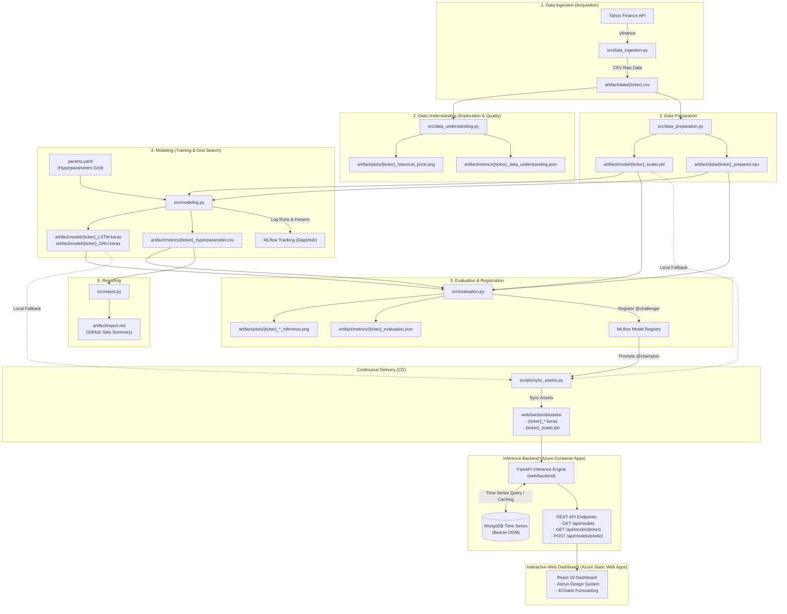
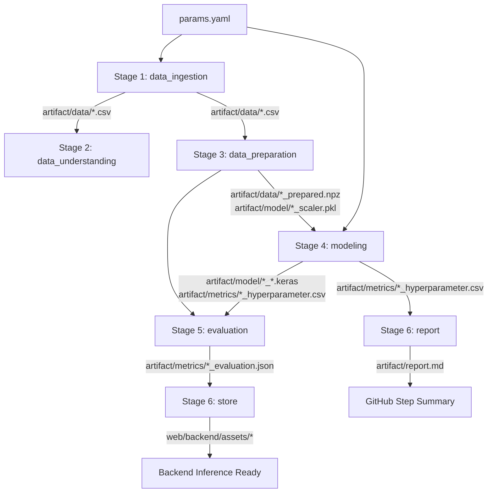
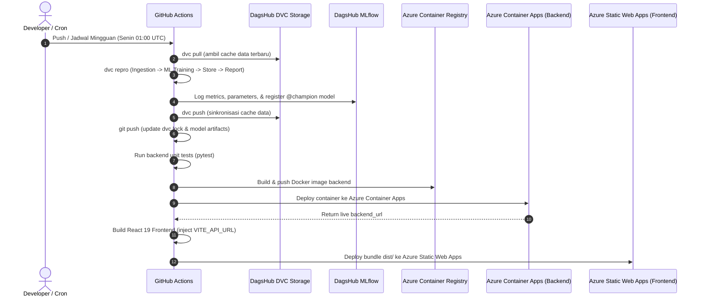

# 📈 MLOps Stock Forecasting - Deep Learning Pipeline & Web Dashboard

[](https://dvc.org/)
[](https://dagshub.com/qoriib/MLOps-Stock-Forecasting.mlflow)
[](https://dagshub.com/qoriib/MLOps-Stock-Forecasting)
[](https://fastapi.tiangolo.com/)
[](https://www.mongodb.com/)
[](https://react.dev/)
[](https://azure.microsoft.com/)
[](https://github.com/features/actions)

Sistem **MLOps End-to-End** kelas industri untuk peramalan harga saham temporal perbankan Indonesia (seperti `BBCA.JK` dan `BBRI.JK`) berbasis Deep Learning (**LSTM** dan **GRU**). Proyek ini mengintegrasikan seluruh siklus hidup *Machine Learning*: akuisisi data otomatis, orkestrasi pipeline berbasis **DVC**, pelacakan eksperimen & model registry **MLflow (DagsHub)**, *champion-challenger model promotion*, inferensi performa tinggi melalui **FastAPI**, penyimpanan data deret waktu dengan **MongoDB Time Series Collection (Beanie ODM)**, serta dashboard analitik interaktif berbasis **React 19** dan **Astryx Design System** di **Azure**.

---

## 📑 Daftar Isi

- [Tech Stack Komprehensif](#-tech-stack-komprehensif)
- [Arsitektur Sistem End-to-End](#-arsitektur-sistem-end-to-end)
- [Keunggulan & Karakteristik Desain](#-keunggulan--karakteristik-desain)
- [Struktur Direktori Repositori](#-struktur-direktori-repositori)
- [Tahapan Pipeline MLOps (DVC)](#-tahapan-pipeline-mlops-dvc)
- [Pelacakan Eksperimen & Registrasi Model (MLflow & DagsHub)](#-pelacakan-eksperimen--registrasi-model-mlflow--dagshub)
- [Parameter Pipeline & Hyperparameter Tuning (`params.yaml`)](#-parameter-pipeline--hyperparameter-tuning-paramsyaml)
- [Metrik Evaluasi & Pemilihan Model](#-metrik-evaluasi--pemilihan-model)
- [Arsitektur Backend API (FastAPI & MongoDB)](#-arsitektur-backend-api-fastapi--mongodb)
- [Arsitektur Frontend Dashboard (React 19)](#-arsitektur-frontend-dashboard-react-19)
- [Otomasi CI/CD & Deployment (GitHub Actions)](#-otomasi-cicd--deployment-github-actions)
- [Panduan Menjalankan Secara Lokal](#-panduan-menjalankan-secara-lokal)
- [Matriks Variabel Lingkungan (.env)](#-matriks-variabel-lingkungan-env)
- [Pengujian Otomatis (Automated Testing)](#-pengujian-otomatis-automated-testing)
- [Troubleshooting & Solusi Masalah Umum](#-troubleshooting--solusi-masalah-umum)

---

## 🛠️ Tech Stack Komprehensif

Proyek ini dibangun di atas kombinasi teknologi modern dari ranah Data Science, Machine Learning Engineering, Backend Systems, Web Development, hingga Cloud Infrastructure:

| Kategori | Teknologi | Versi | Peran & Alasan Penggunaan |
|---|---|---|---|
| **Deep Learning & Modeling** | [TensorFlow](https://www.tensorflow.org/) / [Keras](https://keras.io/) | `2.19.1` / `3.x` | Arsitektur neural network temporal (**LSTM** & **GRU**) untuk pemodelan non-linear deret waktu |
| | [Scikit-Learn](https://scikit-learn.org/) | `>=1.4.0` | Normalisasi fitur (`MinMaxScaler`) dan kalkulasi metrik evaluasi (`mean_squared_error`) |
| | [NumPy](https://numpy.org/) | `>=1.26.0` | Operasi komputasi array multidimensi dan manipulasi data matriks |
| | [Pandas](https://pandas.pydata.org/) | `>=2.2.0` | Pengolahan struktur tabular deret waktu dan agregasi data pasar modal |
| | [yfinance](https://github.com/ranaroussi/yfinance) | `>=0.2.30` | Pustaka akuisisi data harga saham historis OHLCV dari Yahoo Finance |
| **Pipeline & MLOps** | [DVC (Data Version Control)](https://dvc.org/) | `>=3.50.0` | Manajemen DAG pipeline deklaratif, tracking data biner, dan hash-based artifact caching |
| | [dvc-s3](https://github.com/iterative/dvc-s3) | `>=3.0.0` | Driver transfer data DVC ke remote cloud object storage berbasis S3 |
| | [MLflow](https://mlflow.org/) | `>=3.0.0` | Pelacakan metrik, logging parameter, artifact store, dan Model Registry (aliasing) |
| | [DagsHub](https://dagshub.com/) | Cloud Hosted | Platform terpusat untuk repositori git, DVC S3 bucket, dan MLflow remote server |
| **Backend & Serving** | [FastAPI](https://fastapi.tiangolo.com/) | `>=0.115.0` | Framework web asynchronous berkecepatan tinggi dengan auto-generated OpenAPI Swagger |
| | [Pydantic v2](https://docs.pydantic.dev/) | `>=2.7.0` | Validasi skema request/response strictly-typed dan deserialisasi data input |
| | [Uvicorn](https://www.uvicorn.org/) | `>=0.30.0` | ASGI web server berkinerja tinggi untuk runtime asynchronous Python |
| | [Gunicorn](https://gunicorn.org/) | `>=22.0.0` | WSGI/ASGI HTTP Server process manager untuk *production grade concurrency* |
| **Database & Caching** | [MongoDB](https://www.mongodb.com/) | Native Time Series | Database dokumen dengan kapabilitas native *Time Series Collection* (`hours` granularity) |
| | [Beanie ODM](https://beanie-odm.net/) | `>=2.0.0` | Asynchronous Object-Document Mapper (ODM) berbasis Motor & Pydantic |
| | [Motor](https://motor.readthedocs.io/) / [PyMongo](https://pymongo.readthedocs.io/) | `>=4.9.0` | Asynchronous driver Python resmi untuk MongoDB |
| **Frontend & UI/UX** | [React](https://react.dev/) | `19.2.0` | Library antarmuka web modern dengan performa render optimal |
| | [TypeScript](https://www.typescriptlang.org/) | `6.0.2` | Menjamin type safety antarmuka, payload API, dan state aplikasi |
| | [Vite](https://vitejs.dev/) | `8.0.0` | Build tool dan bundler frontend instan berbasis ES modules |
| | [TanStack Router](https://tanstack.com/router) | Latest | Client-side routing dengan fully type-safe route matching |
| | [Apache ECharts](https://echarts.apache.org/) | `^6.1.0` | Engine charting interaktif untuk grafik harga candlestick, histori, dan batas proyeksi |
| | [Zustand](https://github.com/pmndrs/zustand) | `^5.0.15` | Manajemen state global ringan, prediktif, dan bebas boilerplate |
| | [Astryx Design System](https://astryx.design/) | `^0.5.4` | Desain antarmuka modular bergaya modern dengan dukungan Dark & Light theme |
| | [StyleX](https://stylexjs.com/) | `^0.19.0` | Sistem styling CSS-in-JS dengan kompilasi atomic CSS efisien |
| **DevOps & Cloud** | [Docker](https://www.docker.com/) | Multi-stage slim | Containerization backend dengan prinsip non-root user (`appuser`) |
| | [GitHub Actions](https://github.com/features/actions) | CI/CD | Otomasi pengujian, pelatihan mingguan, push DVC, dan multi-cloud deployment |
| | [Azure Container Apps](https://azure.microsoft.com/products/container-apps) | Serverless Container | Menjalankan backend FastAPI dalam klaster serverless container terkelola |
| | [Azure Container Registry (ACR)](https://azure.microsoft.com/products/container-registry) | Private Registry | Registri privat penyimpan image Docker backend |
| | [Azure Static Web Apps](https://azure.microsoft.com/products/app-service/static) | Global Edge CDN | Hosting frontend statis global dengan integrasi custom domain & SSL |

---

## 🏛️ Arsitektur Sistem End-to-End

Berikut adalah representasi visual dari arsitektur aliran data, pipeline machine learning, backend inference, dan dashboard visualisasi:



---

## 💎 Keunggulan & Karakteristik Desain

1. **Pencegahan Kebocoran Data (Zero Data Leakage)**:
   - Pembagian data *Train* dan *Test* dilakukan secara kronologis berurutan (*sequential temporal split*) tanpa pengacakan (*no shuffle*), mencerminkan realitas pasar modal di masa mendatang.
   - Normalisasi `MinMaxScaler` di-fit murni pada data latih (*train set*) dan hanya di-transform pada data uji (*test set*).
2. **Reproduktifitas Total Melalui Hash Hashing**:
   - `dvc.lock` merekam *content-based md5 hash* dari input data mentah, parameter `params.yaml`, kode python, hingga bobot model keluaran.
   - Pustaka Python dikunci (*locked*) menggunakan `poetry.lock` untuk konsistensi lingkungan lintas mesin.
3. **Penyimpanan Deret Waktu Optimal (Native Time Series)**:
   - Memanfaatkan fitur native Time Series pada MongoDB dengan *composite indexing* pada `(metadata.ticker, timestamp)`, mengurangi konsumsi storage dan mempercepat retrieval rentang tanggal.
4. **Caching Bertingkat & Sinkronisasi Inkremental**:
   - Backend memverifikasi data harga terakhir di database lokal; bila pengguna meminta rentang tanggal yang lebih baru dari data lokal, backend secara cerdas hanya mengunduh data selisihnya dari Yahoo Finance.
5. **Autoregressive Multi-Step Forecast Aware Hari Bursa**:
   - Model inferensi mengeksekusi peramalan langkah berurutan (*step-by-step*) dengan memanfaatkan prediksi sebelumnya sebagai input jendela berikutnya, dan secara otomatis hanya menyertakan hari perdagangan bursa (*business days / weekdays*).

---

## 📁 Struktur Direktori Repositori

Proyek ini dirancang secara modular dan memisahkan dengan jelas antara pipeline ML, model serving, web dashboard, dan otomatisasi CI/CD:

```text
MLOps-Stock-Forecasting/
├── .dvc/                             # Konfigurasi remote storage & internal DVC
│   └── config                        # Konfigurasi remote DagsHub S3 endpoint
├── .github/
│   ├── actions/
│   │   ├── push-pipeline/            # Action komposit untuk dvc commit, push, & git push
│   │   └── setup-pipeline/           # Action komposit setup Python, Poetry, & dvc pull
│   └── workflows/
│       └── pipeline.yml              # GitHub Actions CI/CD End-to-End Pipeline
├── artifact/                         # Direktori output pipeline yang dilacak DVC & Git
│   ├── data/                         # Dataset mentah (.csv) & dataset siap latih (.npz)
│   ├── metrics/                      # Ringkasan metrik, evaluasi & hyperparameter (.csv & .json)
│   ├── model/                        # Model terlatih (.keras) & scaler (.pkl)
│   ├── plots/                        # Plot tren historis & visualisasi inferensi (.png)
│   └── report.md                     # Laporan metrik & champion model yang digenerate otomatis
├── scripts/                          # Skrip otomasi & operasional di luar core ML
│   └── sync_assets.py                # Sinkronisasi model @champion & scaler ke web/backend/assets
├── src/                              # Sumber kode tahapan modular pipeline MLOps
│   ├── __init__.py
│   ├── config.py                     # Resolusi path artefak, konstanta, & variabel lingkungan
│   ├── data_ingestion.py             # Tahap 1: Pengunduhan & pembersihan data dari Yahoo Finance
│   ├── data_understanding.py         # Tahap 2: Validasi gap tanggal, statistik & visualisasi tren
│   ├── data_preparation.py           # Tahap 3: Pembagian data kronologis & scaling MinMaxScaler
│   ├── modeling.py                   # Tahap 4: Grid search hyperparameter LSTM & GRU
│   ├── evaluation.py                 # Tahap 5: Evaluasi metrik & registrasi model @challenger
│   └── report.py                     # Tahap 6: Agregasi metrik dan pembuatan laporan ringkasan pipeline
├── web/
│   ├── backend/                      # Service API Inferensi berbasis FastAPI
│   │   ├── app/
│   │   │   ├── controllers/          # Logika orkestrasi endpoint (Models & Stocks)
│   │   │   ├── models/               # Pydantic Schemas & Beanie Time Series Entity
│   │   │   ├── routes/               # Deklarasi route endpoint (/api/models, /api/stocks)
│   │   │   ├── services/             # Autoregressive inference engine & MongoDB sync service
│   │   │   ├── config.py             # Konfigurasi runtime backend & koneksi MongoDB
│   │   │   └── main.py               # Inisialisasi FastAPI, CORS, & Beanie Lifespan
│   │   ├── assets/                   # Model Keras (.keras) & Scaler (.pkl) produksi
│   │   ├── tests/                    # Unit testing backend menggunakan Pytest & TestClient
│   │   ├── Dockerfile                # Image container backend berbasis Python 3.12-slim
│   │   ├── gunicorn.conf.py          # Konfigurasi production ASGI server (Uvicorn workers)
│   │   ├── main.py                   # Runner ASGI backend
│   │   └── requirements.txt          # Dependensi Python backend
│   └── frontend/                     # Web Dashboard interaktif berbasis React 19
│       ├── src/
│       │   ├── components/           # ForecastChart (ECharts), ModelInsights, HistoricalTable
│       │   ├── routes/               # TanStack Router page routing
│       │   ├── stores/               # State management berbasis Zustand
│       │   ├── api/                  # Klien API HTTP ke backend
│       │   └── styles/               # Desain antarmuka modern (Astryx Design System)
│       ├── package.json              # Dependensi Frontend (React 19, Vite, TanStack Router)
│       └── vite.config.ts            # Konfigurasi bundler Vite
├── dvc.yaml                          # Definisi tahapan deklaratif DAG pipeline DVC
├── dvc.lock                          # State hash reproducible artefak DVC
├── params.yaml                       # Konfigurasi terpusat parameter pipeline & hyperparameter
├── pyproject.toml                    # Manajemen dependensi lingkungan utama (Poetry)
└── README.md                         # Dokumentasi komprehensif proyek
```

---

## 🔄 Tahapan Pipeline MLOps (DVC)

Pipeline dieksekusi secara otomatis dan deklaratif melalui file [`dvc.yaml`](file:///Users/nfq/Development/MLOps-Stock-Forecasting/dvc.yaml). Setiap tahap memiliki dependensi, parameter, dan luaran (*outputs*) yang terisolasi:



### 1. Stage `data_ingestion` (CRISP-DM: Data Acquisition)
- **Perintah**: `python -m src.data_ingestion --ticker ${item.TICKER} --range-days ${RANGE_DAYS} --end-date ${END_DATE}`
- **Fungsi**:
  - Mengambil data historis OHLCV (Open, High, Low, Close, Volume) dari Yahoo Finance API menggunakan pustaka `yfinance`.
  - Menerapkan parameter fleksibel: `RANGE_DAYS` dan `END_DATE` (`auto` atau spesifik `YYYY-MM-DD`).
  - Standarisasi nama kolom ke huruf kecil, menghapus baris duplikat tanggal, dan mengurutkan secara kronologis.
- **Dependensi**: `src/config.py`, `src/data_ingestion.py`, `params.yaml`.
- **Luaran**: `artifact/data/${item.TICKER}.csv`.

### 2. Stage `data_understanding` (CRISP-DM: Data Understanding)
- **Perintah**: `python -m src.data_understanding --ticker ${item.TICKER} --target-col ${TARGET_COL}`
- **Fungsi**:
  - Pengecekan gap tanggal kalender pada data historis deret waktu.
  - Perhitungan ringkasan statistik deskriptif kolom target (mean, std, min, kuartil, max).
  - Pembuatan visualisasi grafik garis pergerakan harga historis.
- **Dependensi**: `src/config.py`, `src/data_understanding.py`, `artifact/data/${item.TICKER}.csv`.
- **Luaran**:
  - `artifact/plots/${item.TICKER}_historical_price.png`
  - `artifact/metrics/${item.TICKER}_data_understanding.json`

### 3. Stage `data_preparation` (CRISP-DM: Data Preparation)
- **Perintah**: `python -m src.data_preparation --ticker ${item.TICKER} --train-size ${TRAIN_SIZE} --target-col ${TARGET_COL}`
- **Fungsi**:
  - Pembagian data latih dan uji kronologis (*sequential temporal split*, default 90:10, *zero data leakage*).
  - Normalisasi rentang 0-1 (`MinMaxScaler`) yang di-fit murni pada data latih dan di-transform pada data uji.
  - Penyimpanan tensor array siap latih ke file kompresi `.npz` dan objek scaler ke `.pkl`.
- **Dependensi**: `src/config.py`, `src/data_preparation.py`, `artifact/data/${item.TICKER}.csv`.
- **Luaran**:
  - `artifact/model/${item.TICKER}_scaler.pkl`
  - `artifact/data/${item.TICKER}_prepared.npz`

### 4. Stage `modeling` (CRISP-DM: Modeling)
- **Perintah**: `python -m src.modeling --ticker ${item.TICKER} --epochs ${EPOCHS} --random-state ${RANDOM_STATE} --target-col ${TARGET_COL} --params-file params.yaml`
- **Fungsi**:
  - Pembuatan dataset temporal berukuran jendela *time_steps* (`timeseries_dataset_from_array`).
  - Grid search hyperparameter untuk arsitektur **LSTM** dan **GRU**.
  - Pelatihan dengan *Early Stopping* (`monitor="loss"`, `patience=8`, `restore_best_weights=True`).
  - Pencatatan run & parameter ke MLflow serta penyimpanan model terbaik.
- **Dependensi**: `src/config.py`, `src/modeling.py`, `artifact/data/${item.TICKER}_prepared.npz`, `artifact/model/${item.TICKER}_scaler.pkl`.
- **Luaran**:
  - `artifact/model/${item.TICKER}_LSTM.keras`
  - `artifact/model/${item.TICKER}_GRU.keras`
  - `artifact/metrics/${item.TICKER}_hyperparameter.csv`

### 5. Stage `evaluation` (CRISP-DM: Evaluation)
- **Perintah**: `python -m src.evaluation --ticker ${item.TICKER} --target-col ${TARGET_COL}`
- **Fungsi**:
  - Evaluasi model terbaik pada data uji menggunakan metrik **MSE**, **RMSE**, dan **MAPE**.
  - Pembuatan grafik visualisasi inferensi perbandingan data aktual vs prediksi.
  - Pencatatan tensor signature input/output, metrik, artefak scaler, dan registrasi model ke MLflow Model Registry sebagai `@challenger`.
- **Dependensi**: `src/config.py`, `src/evaluation.py`, `artifact/data/${item.TICKER}_prepared.npz`, `artifact/model/*`, `artifact/metrics/${item.TICKER}_hyperparameter.csv`.
- **Luaran**:
  - `artifact/plots/${item.TICKER}_LSTM_inference.png`
  - `artifact/plots/${item.TICKER}_GRU_inference.png`
  - `artifact/metrics/${item.TICKER}_evaluation.json`

### 6. Stage `report` (CRISP-DM: Evaluation Summary & Reporting)
- **Perintah**: `python -m src.report --output artifact/report.md`
- **Fungsi**:
  - Mengagregasi metrik pemahaman data dan gap kalender dari `artifact/metrics/*_data_understanding.json`.
  - Mengagregasi hasil eksperimen serta status model champion/kandidat dari `artifact/metrics/*_hyperparameter.csv`.
  - Menghasilkan ringkasan berformat Markdown ke `artifact/report.md` yang otomatis ditampilkan di GitHub Actions Step Summary.
- **Dependensi**: `src/config.py`, `src/report.py`, `artifact/metrics`.
- **Luaran**: `artifact/report.md`.

### 🔄 Skrip Sinkronisasi Aset (`scripts/sync_assets.py`)
- **Perintah**: `poetry run python scripts/sync_assets.py`
- **Fungsi**:
  - Berada di luar pipeline ML core (`src/`), difokuskan untuk kebutuhan Continuous Delivery (CD) dan serving backend.
  - Mempromosikan model versi terbaru di MLflow Model Registry menjadi `@champion`.
  - Menyalin model `.keras` dan scaler `.pkl` ke direktori `web/backend/assets/` (dengan fallback otomatis ke artefak lokal jika MLflow server offline) agar backend inference siap menyajikan prediksi.

---

## 🧪 Pelacakan Eksperimen & Registrasi Model (MLflow & DagsHub)

Proyek ini memanfaatkan **DagsHub** sebagai remote terpadu untuk DVC Storage dan MLflow Tracking Server:

- **Dashboard DagsHub MLflow**: [https://dagshub.com/qoriib/MLOps-Stock-Forecasting.mlflow](https://dagshub.com/qoriib/MLOps-Stock-Forecasting.mlflow)
- **S3-Compatible Remote Storage**: `s3://dvc` di `https://dagshub.com/qoriib/MLOps-Stock-Forecasting.s3`

### Strategi Model Aliasing (Challenger vs Champion)
```text
┌────────────────────────────────────────────────────────┐
│ 1. ml_pipeline stage: Melatih & meregistrasi model     │
│    -> Diberi tag model alias: @challenger              │
└──────────────────────────┬─────────────────────────────┘
                           │
                           ▼
┌────────────────────────────────────────────────────────┐
│ 2. store stage: Validasi & evaluasi                    │
│    -> Promosi alias: @challenger ──► @champion         │
│    -> Mengunduh bobot champion ke web/backend/assets/  │
└──────────────────────────┬─────────────────────────────┘
                           │
                           ▼
┌────────────────────────────────────────────────────────┐
│ 3. web/backend: Melayani inferensi API                 │
│    -> Menjalankan model champion lokal dengan cepat     │
└────────────────────────────────────────────────────────┘
```

Metode ini memastikan model yang dilayani di *production environment* selalu teruji, terdokumentasi, dan memiliki silsilah (*lineage*) data yang transparan.

---

## ⚙️ Parameter Pipeline & Hyperparameter Tuning (`params.yaml`)

Seluruh variabel eksperimen dikelola secara terpusat di file [`params.yaml`](file:///Users/nfq/Development/MLOps-Stock-Forecasting/params.yaml):

```yaml
TICKERS:
  - BBCA.JK
RANGE_DAYS: 1825
END_DATE: "auto"

TARGET_COL: "close"
RANDOM_STATE: 42
TRAIN_SIZE: 0.9
EPOCHS: 50

# Hyperparameter Grid Space
TIME_STEPS:
  - 10
OPTIMIZERS:
  - Adam
BATCH_SIZES:
  - 8
LEARNING_RATES:
  - 0.01
```

### Penjelasan Parameter

| Kategori | Nama Parameter | Tipe Data | Deskripsi | Nilai Default / Pilihan |
|---|---|---|---|---|
| **Data Scope** | `TICKERS` | List of String | Daftar simbol saham yang diproses dalam matriks pipeline | `["BBCA.JK"]` (dapat ditambah `BBRI.JK`, dll.) |
| | `RANGE_DAYS` | Integer | Jumlah hari historis ke belakang yang diunduh dari Yahoo Finance | `1825` (setara ~5 tahun) |
| | `END_DATE` | String | Tanggal cutoff akhir pengambilan data | `"auto"` (hari ini) atau `"YYYY-MM-DD"` |
| **Data Prep** | `TARGET_COL` | String | Kolom harga saham yang menjadi target peramalan | `"close"` |
| | `RANDOM_STATE` | Integer | Seed acak untuk menjamin reproduktifitas model | `42` |
| | `TRAIN_SIZE` | Float | Proporsi data latih terhadap keseluruhan data | `0.9` (90% train, 10% test) |
| | `EPOCHS` | Integer | Batas maksimal iterasi epoch pelatihan per trial | `50` (dengan *early stopping patience* 8) |
| **Grid Search**| `TIME_STEPS` | List of Integer | Panjang jendela urutan waktu (*lookback window*) | `[10]` (bisa dikonfigurasi `[10, 20, 30]`) |
| | `OPTIMIZERS` | List of String | Algoritma optimasi bobot jaringan saraf | `["Adam"]` (pilihan: `SGD`, `Adam`, `RMSprop`) |
| | `BATCH_SIZES` | List of Integer | Ukuran batch data pada proses *feedforward/backpropagation* | `[8]` (pilihan: `8, 16, 32`) |
| | `LEARNING_RATES`| List of Float | Laju pembelajaran optimizer | `[0.01]` (pilihan: `0.01, 0.001, 0.0001`) |

---

## 📊 Metrik Evaluasi & Pemilihan Model

Evaluasi model pada data uji dilakukan menggunakan 3 metrik kuantitatif:

1. **Mean Squared Error (MSE)**:
   $$\text{MSE} = \frac{1}{n} \sum_{i=1}^{n} (y_i - \hat{y}_i)^2$$
   Memberikan penalti eksponensial terhadap kesalahan prediksi yang besar.
2. **Root Mean Squared Error (RMSE)**:
   $$\text{RMSE} = \sqrt{\text{MSE}}$$
   Memiliki satuan nilai yang sama dengan mata uang harga saham asli (Rupiah), sehingga mudah diinterpretasikan oleh analis pasar.
3. **Mean Absolute Percentage Error (MAPE)**:
   $$\text{MAPE} = \frac{100\%}{n} \sum_{i=1}^{n} \left| \frac{y_i - \hat{y}_i}{y_i} \right|$$
   Menunjukkan persentase deviasi rata-rata model terhadap harga aktual. Nilai MAPE di bawah 5% mengindikasikan tingkat akurasi peramalan yang sangat tinggi (*highly accurate*).

**Kriteria Pemilihan Champion Model**: Konfigurasi hyperparameter yang menghasilkan **RMSE terendah** secara otomatis dipilih sebagai model champion untuk arsitektur terkait.

---

## ⚡ Arsitektur Backend API (FastAPI & MongoDB)

Backend inferensi dibangun menggunakan **FastAPI** dengan mengadopsi prinsip *Clean Architecture* dan *Separation of Concerns* (Routes, Controllers, Services, dan Models).

### Fitur Kunci Backend
1. **Model Serving Mandiri**: Membaca model `.keras` dan `scaler.pkl` langsung dari `web/backend/assets/` menggunakan memori *cache* internal (`model_cache_storage`), sehingga inferensi berlangsung instan tanpa *cold-start delay* berulang.
2. **MongoDB Native Time Series & Beanie ODM**:
   - Menyimpan histori harga saham menggunakan koleksi deret waktu native MongoDB (`timeseries: { timeField: "timestamp", metaField: "metadata", granularity: "hours" }`).
   - Dilengkapi *composite index* pada `metadata.ticker` dan `timestamp` untuk kueri rentang tanggal berkecepatan tinggi.
3. **Sinkronisasi Data Otomatis & Caching Adaptif**:
   - `StockService` mendeteksi tanggal data terakhir yang tersimpan di MongoDB.
   - Jika pengguna meminta data yang lebih baru dari data lokal, backend secara transparan melakukan *incremental fetch* ke Yahoo Finance dan menyimpannya ke database MongoDB.
4. **Autoregressive Multi-Step Forecast**:
   - Model memprediksi satu langkah ke depan (*t+1*), memperbarui jendela input (*sliding window*), lalu melanjutkan prediksi hingga rentang hari kerja (*business days / non-weekend*) yang diminta tercapai.

### Spesifikasi REST API Endpoints

#### 1. `GET /` - Root Health Check & Endpoint Index
- **Deskripsi**: Menampilkan informasi status layanan dan daftar endpoint yang tersedia.
- **Response**:
  ```json
  {
    "project": "Stock Forecast",
    "endpoints": {
      "models": "/api/models",
      "predict": "/api/models/predict",
      "stocks": "/api/stocks/{ticker}",
      "docs": "/docs"
    }
  }
  ```

#### 2. `GET /api/models` - Ringkasan Model Tersedia
- **Deskripsi**: Mengambil daftar ticker saham dan arsitektur model yang asetnya tersedia untuk inferensi.
- **Response**:
  ```json
  {
    "tickers": ["BBCA.JK", "BBRI.JK"],
    "models": ["gru", "lstm"]
  }
  ```

#### 3. `GET /api/stocks/{ticker}?start_date={YYYY-MM-DD}&end_date={YYYY-MM-DD}` - Riwayat Harga Saham
- **Parameter**:
  - `ticker` (*path*): Simbol saham (contoh: `BBCA.JK`)
  - `start_date` (*query*): Tanggal awal (format `YYYY-MM-DD`)
  - `end_date` (*query*): Tanggal akhir (format `YYYY-MM-DD`)
- **Response**:
  ```json
  {
    "ticker": "BBCA.JK",
    "data": [
      {
        "date": "2026-09-01",
        "open": 6175.0,
        "high": 6250.0,
        "low": 6150.0,
        "close": 6225.0,
        "volume": 78241200.0
      }
    ]
  }
  ```

#### 4. `POST /api/models/predict` - Inferensi Peramalan Harga
- **Request Body**:
  ```json
  {
    "ticker": "BBCA.JK",
    "model": "lstm",
    "start_date": "2026-09-28",
    "end_date": "2026-10-02"
  }
  ```
- **Response**:
  ```json
  {
    "ticker": "BBCA.JK",
    "model": "lstm",
    "predictions": [
      { "date": "2026-09-28", "predicted_price": 6278.45 },
      { "date": "2026-09-29", "predicted_price": 6291.12 },
      { "date": "2026-09-30", "predicted_price": 6305.80 },
      { "date": "2026-10-01", "predicted_price": 6314.20 },
      { "date": "2026-10-02", "predicted_price": 6322.95 }
    ]
  }
  ```

---

## 🖥️ Arsitektur Frontend Dashboard (React 19)

Aplikasi frontend adalah *Single Page Application* (SPA) modern yang dibangun menggunakan:
- **Framework**: **React 19** dengan TypeScript dan **Vite** sebagai *build tool*.
- **Routing**: **TanStack Router** untuk penanganan navigasi *type-safe*.
- **Desain & UI**: **Astryx Design System** dengan tema gelap (*dark mode*) dan terang (*light mode*), transisi halus, dan antarmuka responsif.
- **Visualisasi Data**: **Apache ECharts** untuk visualisasi interaktif data harga historis (candlestick/line) dan proyeksi peramalan multi-step beserta batas toleransi.
- **State Management**: **Zustand** untuk manajemen state aplikasi (pilihan ticker, model aktif, tanggal filter, dan data prediksi).

---

## 🚀 Otomasi CI/CD & Deployment (GitHub Actions)

Alur kerja otomatisasi diatur dalam [`.github/workflows/pipeline.yml`](file:///Users/nfq/Development/MLOps-Stock-Forecasting/.github/workflows/pipeline.yml):



---

## 💻 Panduan Menjalankan Secara Lokal

### Prasyarat Sistem
- **Python**: Versi `3.10` hingga `3.12`
- **Poetry**: Manajemen dependensi Python (`pip install poetry`)
- **Node.js**: Versi `20+` & `npm`
- **MongoDB**: MongoDB instance lokal (`mongodb://localhost:27017`) atau MongoDB Atlas URI

---

### 1. Kloning Repositori & Setup Environment Utama

```bash
git clone https://github.com/qoriib/MLOps-Stock-Forecasting.git
cd MLOps-Stock-Forecasting

# Salin konfigurasi environment
cp .env.example .env

# Pasang seluruh dependensi pipeline dengan Poetry
poetry install
```

---

### 2. Menjalankan Pipeline MLOps (DVC)

```bash
# Tarik data dan cache model dari remote storage (opsional)
poetry run dvc pull

# Jalankan seluruh siklus pipeline secara otomatis
poetry run dvc repro

# Menampilkan grafik ketergantungan DAG pipeline
poetry run dvc dag
```

---

### 3. Menjalankan Backend API (FastAPI)

```bash
cd web/backend

# Buat virtual environment lokal untuk backend
python3 -m venv .venv
source .venv/bin/activate  # Untuk Windows: .venv\Scripts\activate

# Install dependensi backend
pip install -r requirements.txt

# Salin file konfigurasi .env backend
cp .env.example .env

# Jalankan server FastAPI
uvicorn main:app --host 0.0.0.0 --port 8000 --reload
```
Akses dokumentasi interaktif Swagger UI di: [http://localhost:8000/docs](http://localhost:8000/docs).

---

### 4. Menjalankan Frontend Dashboard (React 19)

Buka terminal baru:
```bash
cd web/frontend

# Pasang dependensi Node.js
npm install

# Jalankan development server
npm run dev
```
Buka browser Anda dan akses aplikasi di: [http://localhost:3000](http://localhost:3000).

---

## 🔐 Matriks Variabel Lingkungan (.env)

Berikut adalah daftar variabel lingkungan yang digunakan di setiap lapisan proyek:

### 1. Root Environment (`.env`)
| Variabel | Deskripsi | Contoh Nilai |
|---|---|---|
| `MLFLOW_TRACKING_URI` | URI endpoint tracking server DagsHub MLflow | `https://dagshub.com/qoriib/MLOps-Stock-Forecasting.mlflow` |
| `MLFLOW_TRACKING_USERNAME` | Username akun DagsHub | `qoriib` |
| `MLFLOW_TRACKING_PASSWORD` | Personal Access Token (PAT) DagsHub | `token_dagshub_xyz` |
| `AWS_ACCESS_KEY_ID` | Access Key ID untuk DVC remote storage DagsHub | `aws_key_id_xyz` |
| `AWS_SECRET_ACCESS_KEY` | Secret Key untuk DVC remote storage DagsHub | `aws_secret_key_xyz` |

### 2. Backend Environment (`web/backend/.env`)
| Variabel | Deskripsi | Nilai Default |
|---|---|---|
| `PORT` | Port server FastAPI | `8000` |
| `MONGODB_URL` | Connection string URI basis data MongoDB | `mongodb://localhost:27017` |
| `MONGODB_DB_NAME` | Nama database time series saham di MongoDB | `stock_forecasting` |
| `WEB_CONCURRENCY` | Jumlah worker thread Gunicorn (produksi) | `2` |

### 3. Frontend Environment (`web/frontend/.env`)
| Variabel | Deskripsi | Contoh Nilai |
|---|---|---|
| `VITE_API_URL` | URL basis host backend API | `http://localhost:8000` (lokal) atau URL Container App |

### 4. GitHub Actions Secrets
| Secret Name | Kategori | Deskripsi |
|---|---|---|
| `AWS_ACCESS_KEY_ID` | DVC Storage | Access Key ID untuk remote S3 DagsHub |
| `AWS_SECRET_ACCESS_KEY` | DVC Storage | Secret Access Key untuk remote S3 DagsHub |
| `MLFLOW_TRACKING_URI` | MLflow | Endpoint URI pelacakan eksperimen DagsHub MLflow |
| `MLFLOW_TRACKING_USERNAME` | MLflow | Username akun DagsHub |
| `MLFLOW_TRACKING_PASSWORD` | MLflow | Token akses personal DagsHub |
| `AZURE_CREDENTIALS` | Cloud Deployment | Kredensial Service Principal Azure (format JSON) |
| `AZURE_STATIC_WEB_APPS_API_TOKEN` | Cloud Deployment | Deployment token untuk Azure Static Web Apps |

---

## 🧪 Pengujian Otomatis (Automated Testing)

Proyek ini dilengkapi pengujian menyeluruh pada backend API menggunakan `pytest` dan *mocking* koneksi database:

```bash
cd web/backend
pytest tests/ -v
```

Hasil pengujian mencakup verifikasi:
- Ketersediaan endpoint root (`GET /`) dan dokumentasi OpenAPI (`GET /docs`).
- Validasi skema request dan pemfilteran input ticker & model pada `POST /api/models/predict`.
- Pengujian penanganan rute harga saham `GET /api/stocks/{ticker}`.
- Mocking inferensi multi-step autoregressive model.

---

## ❓ Troubleshooting & Solusi Masalah Umum

### 1. `dvc pull` gagal atau meminta kredensial
- **Penyebab**: Kredensial AWS DagsHub belum terisi di `.env`.
- **Solusi**: Pastikan `AWS_ACCESS_KEY_ID` dan `AWS_SECRET_ACCESS_KEY` telah disetel di root `.env`, atau jalankan:
  ```bash
  poetry run dagshub login
  ```

### 2. Gagal koneksi ke MongoDB saat menjalankan backend
- **Penyebab**: Server MongoDB lokal belum aktif.
- **Solusi**: Pastikan service MongoDB berjalan di sistem Anda:
  ```bash
  # macOS (Homebrew)
  brew services start mongodb-community
  
  # Linux (Systemd)
  sudo systemctl start mongod
  ```
  Atau gunakan MongoDB Atlas cloud URI pada variabel `MONGODB_URL` di `web/backend/.env`.

### 3. Model file `.keras` atau `.pkl` tidak ditemukan di `web/backend/assets`
- **Penyebab**: Tahapan pipeline `store` belum dijalankan.
- **Solusi**: Jalankan pipeline DVC untuk mereproduksi aset:
  ```bash
  poetry run dvc repro store
  ```

---

## 👨‍💻 Kontributor

- **Nashrullah Fathul Qoriib** ([@qoriib](https://github.com/qoriib)) - Insinyur AI & MLOps
- Program Studi Teknik Informatika, Institut Teknologi Sumatera (ITERA)

---

## 📄 Lisensi

Proyek ini dilisensikan di bawah ketentuan [MIT License](LICENSE).
